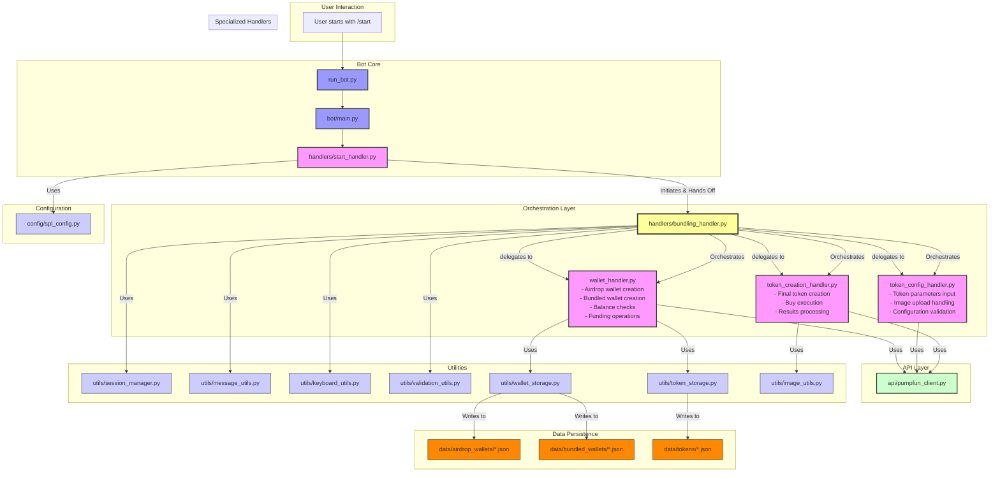

# Codebase Analysis: Bundling Handler Modular Architecture

This document outlines the refactored architecture of the `ninjabot` codebase, focusing on the modular organization of the bundling workflow into specialized handlers.

## High-Level Overview

The bot is structured around the `python-telegram-bot` library, using a `ConversationHandler` to manage multi-step user interactions. The architecture has been refactored to cleanly separate concerns into specialized handler modules:

-   **Entry Point & Routing (`run_bot.py`, `bot/main.py`, `bot/handlers/start_handler.py`):** Initiates the bot and directs conversation flow.
-   **Orchestration (`bot/handlers/bundling_handler.py`):** Pure orchestrator that coordinates the complete bundling workflow.
-   **Specialized Business Logic:**
    - `wallet_handler.py`: Manages airdrop/bundled wallet creation, funding, and balance checks
    - `token_config_handler.py`: Handles token parameter input and configuration
    - `token_creation_handler.py`: Manages final token creation and execution
-   **API Abstraction (`bot/api/pumpfun_client.py`):** Handles all external communication with the Pump.fun backend API.
-   **Utilities (`bot/utils/`):** A collection of helper modules for tasks like session management, data validation, UI generation (messages/keyboards), and persistent storage.
-   **Configuration (`bot/config/`):** Centralized configuration for application settings and conversation states.
-   **Data Persistence (`data/`):** Simple file-based storage for wallets and tokens.

---

## Modular Component Relationship Map

The following diagram illustrates the refactored modular architecture and flow of control between specialized handlers.

---

## Detailed Component Interactions

### 1. Entry Point & Conversation Flow (`start_handler.py`)

-   **Initiation:** The user's journey begins in `start_handler.py`. The `start` function displays the main menu, and the `activity_choice` function handles the user's selection.
-   **Hand-off:** When the user selects "Token Bundling (PumpFun)", the `activity_choice` function calls `start_bundling_workflow`.
-   **`start_bundling_workflow`:** This function acts as the bridge. It instantiates the `PumpFunClient`, stores it in the user's session, performs an API health check, and presents the first step of the bundling workflow. The `ConversationHandler` then directs all subsequent user actions to the appropriate functions within `bundling_handler.py`.

### 2. Core Logic (`bundling_handler.py`)

-   This module is the heart of the feature, containing all the `async` functions that correspond to the different states of the token creation process (e.g., `create_airdrop_wallet`, `token_parameter_input`, `check_wallet_balance`, `create_token_final`).
-   It drives the user interaction forward by returning the next `ConversationState` enum value at the end of each step, telling the `ConversationHandler` where to go next.

### 3. API Interaction (`api/pumpfun_client.py`)

-   **Abstraction:** `bundling_handler.py` never makes direct HTTP requests. It exclusively uses the `PumpFunClient` as an abstraction layer.
-   **Key Methods Called:**
    -   `create_airdrop_wallet()`: To create or import the main funding wallet.
    -   `create_bundled_wallets()`: To generate the set of child wallets.
    -   `get_wallet_sol_balance()`: To check if wallets are sufficiently funded.
    -   `fund_bundled_wallets()`: To distribute SOL from the airdrop wallet to the child wallets.
    -   `return_funds_to_mother()`: To consolidate funds back to the airdrop wallet.
    -   `create_token_and_buy()`: The final call to create the SPL token and execute initial buys.

### 4. Supporting Utilities (`utils/`)

The `bundling_handler` is a major consumer of the utility modules:

-   **`session_manager.py`:** Used in every step to get and set data for the current user's session (e.g., `pumpfun_client`, `airdrop_wallet_address`, `token_params`). This maintains context across multiple user interactions.
-   **`wallet_storage.py` & `token_storage.py`:** Used for persistence. After creating wallets or tokens, the handler calls methods like `airdrop_wallet_storage.save_airdrop_wallet()` to save the generated data to JSON files in the `/data` directory.
-   **`message_utils.py`:** Used extensively to format all user-facing messages (e.g., `format_token_creation_preview()`), separating presentation from business logic.
-   **`keyboard_utils.py`:** Used to build all interactive keyboards with `build_button` and `InlineKeyboardMarkup`.
-   **`validation_utils.py`:** Used to validate all user input (e.g., `validate_token_name`, `validate_buy_amount`) before processing.
-   **`image_utils.py`:** The `TelegramImageProcessor` is used to download and temporarily store a user-uploaded token image.

### 5. Configuration (`config/`)

-   **`spl_config.py`:** The `ConversationState` enum defined here is used by both `start_handler` and `bundling_handler` to manage and transition the conversation flow state.

---

## Refactoring Implementation Summary

### Completed Modular Architecture

The bundling workflow has been successfully refactored into a modular architecture following MONOCODE principles:

**1. Orchestration Layer (`bundling_handler.py`)**
- **Role**: Pure orchestrator that coordinates the complete workflow
- **Responsibilities**: 
  - Import and wire together specialized handlers
  - Manage ConversationHandler assembly
  - Handle core buy amounts configuration (shared workflow logic)
  - Provide utility functions for the workflow
- **Design Principle**: Observable implementation with structured logging and clear separation of concerns

**2. Specialized Handler Modules**

**`wallet_handler.py`** - Wallet Management Specialist
- Airdrop wallet creation and import
- Bundled wallet creation and management  
- Balance checking and validation
- Wallet funding operations
- Return funds functionality

**`token_config_handler.py`** - Token Configuration Specialist
- Token parameter input (name, ticker, description)
- Image upload handling and processing
- Parameter validation and error handling
- Configuration state management

**`token_creation_handler.py`** - Token Creation Specialist
- Final token creation and preview
- Buy execution with configured amounts
- Results processing and storage
- API integration for token operations

### Architecture Benefits

1. **Maintainability**: Each handler has a single, clear responsibility
2. **Testability**: Individual handlers can be tested in isolation
3. **Scalability**: New features can be added without affecting existing handlers
4. **Debugging**: Issues can be traced to specific, focused modules
5. **Code Reuse**: Handler functions can be imported and reused in other workflows

### Progressive Construction Implementation

Following MONOCODE principles, the refactoring was implemented incrementally:
- Each step maintained full bot functionality
- Changes were validated after each module extraction
- Regression testing ensured no functionality loss
- Observable implementation through structured logging

This structured approach makes the codebase modular, readable, and maintainable. The `bundling_handler.py` acts as a central orchestrator for its specific feature, delegating tasks to specialized components.
